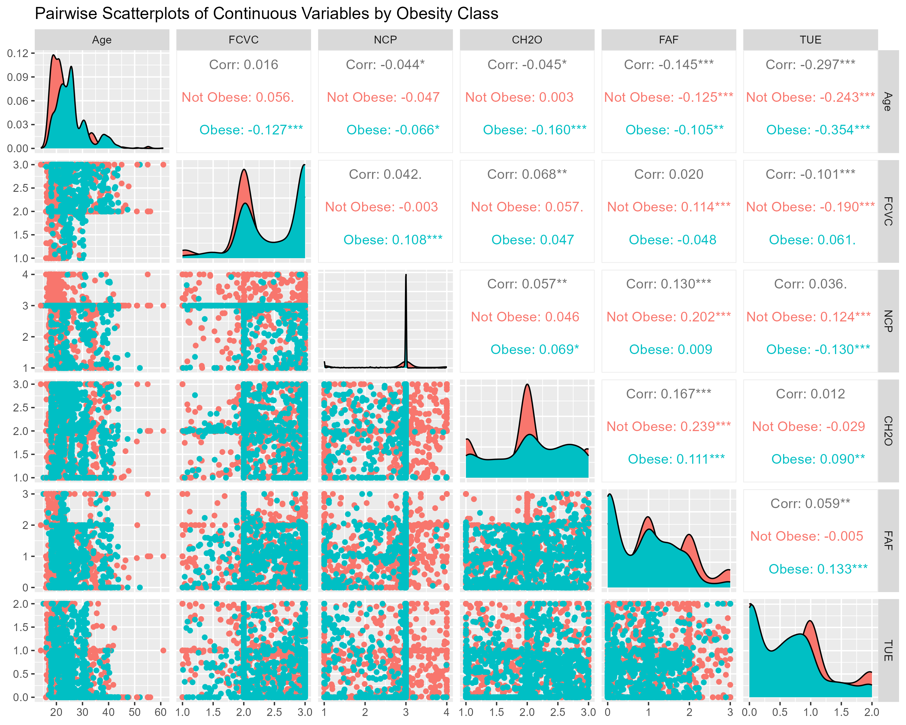
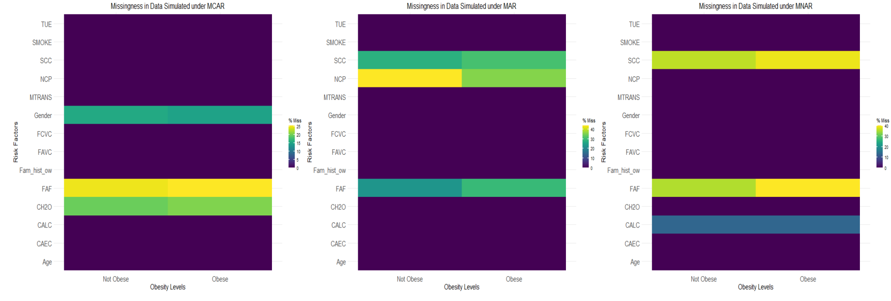

```{r setup, include=FALSE}
knitr::opts_chunk$set(echo = FALSE,
                      message = FALSE,
                      warning = FALSE, 
                      dpi = 300)
```


# Introduction

### Overview of Missingness Mechanisms

Missing data, whether due to corruption or logistical issues, can bias estimates, inflate standard errors, and invalidate inferences if not properly handled [@rubin1987statistical]. Rubin’s (1976) framework [@rubin1976inference] defines three mechanisms: Missing Completely at Random (MCAR), where missingness is unrelated to any data; Missing at Random (MAR), where missingness depends only on observed data; and Missing Not at Random (MNAR), where missingness depends on unobserved values, posing the greatest challenge and requiring strong, often unverifiable assumptions [@enders2022applied]. Complete-case analysis is commonly used in applied research for its simplicity, but under MAR or MNAR conditions, it can introduce bias and reduce efficiency [@schafer2002missing]. Single imputation methods (e.g., mean substitution) also perform poorly, distorting distributions and underestimating uncertainty. In contrast, Multiple Imputation by Chained Equations (MICE) and related model-based approaches simulate missing values multiple times and pool results to reflect imputation uncertainty [@van2011mice]. While increasingly popular, the performance of these methods varies depending on the nature and extent of missingness mechanism [@donders2006gentle]. Simulation studies allow systematic evaluation of these methods by generating complete data, imposing missingness mechanisms, and comparing outcomes such as bias, confidence interval coverage, prediction accuracy, and model fit (e.g., AIC, BIC) [@audigier2016principal ; @carpenter2023multiple].


### Relevance to Obesity Research

Obesity presents a growing public health challenge worldwide, contributing to increased risk of cardiovascular disease, type 2 diabetes, hypertension, musculoskeletal disorders, and certain cancers. According to the World Health Organization (2024) [@world2024obesity], global obesity prevalence has tripled since 1975, and over 650 million adults are currently classified as obese. In Latin America, where countries like Mexico, Peru, and Colombia are experiencing rapid nutrition and lifestyle transitions, obesity rates have surged across all age groups[@rivera2014childhood; @moubarac2015ultra; @food2019drink]. The determinants of obesity are multifactorial, including sociodemographic variables, poor dietary patterns, inadequate physical activity, sedentary behaviors, and harmful habits such as smoking and alcohol consumption[@palechor2019dataset;@de2019obesity]. These risk factors are often collected via self-report or web-based tools, making them especially vulnerable to missingness due to social desirability bias, recall error, or issues with technology access. Understanding how missing data may bias the estimation of such relationships is critical for valid epidemiologic inference.

### Study Objective

The objective of this project is to conduct a simulation study using the [UCI Obesity](https://archive.ics.uci.edu/dataset/544/estimation+of+obesity+levels+based+on+eating+habits+and+physical+condition) dataset to assess how various imputation techniques perform under MCAR, MAR, and MNAR scenarios.


# Methods

## Data Source

We used the `obesity.levels` dataset from the `fairml` R package, which contains 2,111 records from individuals in Mexico, Peru, and Colombia. The dataset includes 17 demographic, behavioral, and physical condition attributes used to estimate obesity levels, labeled by the `NObeyesdad` variable. Approximately 77% of the data were synthetically generated using Weka and SMOTE, while 23% were collected via a web platform. Further details are elsewhere [@palechor2019dataset; @de2019obesity]. The binary outcome variable, denoted as `Obesity`, was derived from the original multiclass label `NObeyesdad` by coding individuals with Obesity Type I, II, or III as "Obese" and others as "Not Obese". Continuous predictors included: Age, `FCVC` (Frequency of vegetable consumption), `NCP` (Number of main meals), `CH2O` (daily water intake), `FAF` (physical activity frequency), and `TUE` (time using technology). Categorical variables included Gender, family history with overweight, high-calorie food consumption (`FAVC`), food between meals (`CAEC`), smoking (`SMOKE`), calorie monitoring (`SCC`), alcohol consumption (`CALC`), and transportation type (`MTRANS`).

## Missing Data Generation Mechanisms

We simulated missingness under three mechanisms: To simulate MCAR, we randomly introduced missing values in three variables; `Gender`, `FAF`, and `CH2O`, with predefined rates of 15%, 25%, and 20%, respectively. The probability of missingness in these variables is independent of any observed or unobserved data. We simulated MAR by conditioning missingness on observed covariates. Specifically: `FAF` was more likely to be missing for older males; `SCC` was more likely to be missing among participants reporting high-calorie food consumption; `NCP` was more likely to be missing for younger females. Probabilities of missingness were generated using logistic functions of these predictors.For MNAR, missingness depended on unobserved (true) values of the variables themselves: `FAF` missingness was more likely in individuals with low physical activity; `CALC` was more likely missing in frequent drinkers; `SCC` missingness was higher among participants who did not monitor calories. These dependencies reflect real-world challenges where values themselves influence their probability of being missing.

## Imputation Methods

We applied three common strategies to handle missing data; (1) Complete Case Analysis where all records with missing values in any of the selected predictors were excluded; (2) Mean/Mode Imputation where for continuous variables, missing values were imputed using the mean of observed values and for categorical variables, the most frequent category (mode) was used; (3) MICE using the `mice` package was used to perform 5 multiple imputations using chained equations. 

## Model Fitting and Evaluation

We trained logistic regression models to predict `Obesity` across all datasets (Original, MCAR, MAR, MNAR) and imputation methods. Each dataset was split into training (70%) and test (30%) sets using stratified sampling to preserve the outcome distribution. Model performance was evaluated using the following metrics: **Accuracy:** Proportion of correct classifications; **Sensitivity (Recall):** Proportion of obese individuals correctly identified; **Specificity:** Proportion of non-obese individuals correctly identified; **Area Under the ROC Curve (AUC):** Discriminative ability of the model; **F1 Score:** Harmonic mean of precision and recall. Model metrics were computed separately for the training and test sets. For MICE, pooled predictions across imputations were used for test metrics, and average metrics were reported for training.

# Results


### Exploratory Data Analysis

We conducted exploratory analysis to examine predictor distributions and associations by obesity status. The outcome was moderately balanced (54% Not Obese, 46% Obese). A correlation plot revealed notable differences by class; for example, `Age` and `TUE` were negatively correlated (r = –0.297 overall), more so among obese participants. Relationships between `FCVC` and `NCP` also varied across groups, see Figure 1. We used Little’s MCAR test (`naniar`, `misty`) to assess missingness in the simulated dataset. Results ($\chi^2 = 103.68$, df = 93, $p = 0.211$) suggest the data was consistent with MCAR. There were 8 unique missing patterns, with 1031 of 2111 cases missing at least one value. Formal tests for MAR or MNAR were not possible; distinguishing these mechanisms requires unverifiable assumptions or external data. Missingness patterns are shown in Figure 2. For example, we can see that under MCAR, missing values are evenly distributed and show no dependency on obesity status. Recognizing these patterns is key because they guide the assumptions behind imputation models and influence their effectiveness.


```{r}
# ==============================================================================
# Load Required Libraries
# ==============================================================================
library(mice)        # Multiple imputation using chained equations (MICE)
library(caret)       # Data splitting, model training, and performance metrics
library(pROC)        # ROC curve analysis and AUC calculations
library(tidyverse)   # Data manipulation and visualization
library(naniar)      # Missing data visualization and diagnostics
library(fairml)      # Accessing the obesity.levels dataset used in this study
library(misty)       # Additional missing data analysis tools and diagnostics
library(mvnmle)      # Maximum likelihood estimation with missing values
library(ggplot2)     # For creating publication-quality visualizations
library(gridExtra)   # For arranging multiple ggplot2 plots in a grid layout
library(magick)      # For reading, editing, and saving images in R (e.g., PNG, JPG); supports image processing workflows.
library(grid)        # Base R package for raster images on a grid layout.
library(kableExtra)  # For formatting tables
library(GGally)      # Pairs Plot

```


```{r, include=FALSE}
# ==============================================================================
# Load and Prepare the Dataset
# ==============================================================================
data(obesity.levels)  # Load dataset from fairml package

# Create binary obesity classification
obesity.levels$Obesity <- ifelse(obesity.levels$NObeyesdad %in% 
                                      c("Obesity_Type_I", "Obesity_Type_II", "Obesity_Type_III"), 
                                      1, 0)
obesity.levels$Obesity <- factor(obesity.levels$Obesity, 
                                     levels = c(0, 1), 
                                     labels = c("Not Obese", "Obese"))
obesity.levels <- obesity.levels %>%
  rename(Fam_hist_ow = family_history_with_overweight)

# Define variable types
cont_vars <- c("Age", "FCVC", "NCP", "CH2O", "FAF", "TUE")  
cat_vars <- c("Gender", "Fam_hist_ow", "FAVC", "CAEC", 
              "SMOKE", "SCC", "CALC", "MTRANS")  
target_var <- "Obesity"

# Final dataset without Height/Weight
obesity_full <- obesity.levels %>% 
  select(all_of(c(cont_vars, cat_vars, target_var)))

# ==============================================================================
# Exploratory Data Analysis
# ==============================================================================

# Outcome distribution

table(obesity_full$Obesity)  # Not Obese: 1139      Obese: 972
            
# Proportions
prop.table(table(obesity_full$Obesity)) # Not Obese: 0.5395547  Obese: 0.4604453  
 
# Box plots for a few key continuous variables

obesity_full %>%
  pivot_longer(cols = all_of(cont_vars), names_to = "Variable", values_to = "Value") %>%
  ggplot(aes(x = Obesity, y = Value, fill = Obesity)) +
  geom_boxplot() +
  facet_wrap(~Variable, scales = "free", ncol = 3) +
  labs(title = "Distribution of Continuous Predictors by Obesity Status") +
  theme_minimal()


# Proportions of categorical variables by class
cat_summary <- function(var) {
  obesity_full %>%
    count(!!sym(var), Obesity) %>%
    group_by(!!sym(var)) %>%
    mutate(Percent = n / sum(n) * 100)
}

cat_vars %>% map(cat_summary)

# Pairs plot
ggpairs(obesity_full, 
        columns = cont_vars, 
        aes(color = Obesity),
        title = "Pairwise Scatterplots of Continuous Variables by Obesity Class")
ggsave("Analysis/pairs_plot.png", width = 10, height = 8)

```

```{r fig.align='center', out.height=="100%", out.width="100%", dpi=600, fig.cap= "Exploratory Data Analysis of Continuous Predictors by Obesity Status"}

```


```{r}

# ==============================================================================
# Missing Data Simulation Functions
# ==============================================================================

# MCAR: Missing completely at random
simulate_mcar <- function(data, vars, rates) {
  set.seed(123)
  mcar_data <- data
  for (i in seq_along(vars)) {
    var <- vars[i]
    rate <- rates[i]
    missing_idx <- sample(nrow(data), size = floor(rate * nrow(data)))
    mcar_data[missing_idx, var] <- NA
  }
  return(mcar_data)
}

# MAR: Missing at random (depends on other observed variables)
simulate_mar <- function(data) {
  set.seed(123)
  mar_data <- data
  
  # FAF missingness: Higher in older males
  age_scaled <- scale(data$Age)
  male <- as.numeric(data$Gender == "Male")
  logit_faf <- -1.5 + 0.8*age_scaled + 0.7*male
  p_faf <- plogis(logit_faf)
  missing_faf <- rbinom(nrow(data), 1, p_faf) == 1
  mar_data$FAF[missing_faf] <- NA
  
  # SCC missingness: Higher in those who consume high-calorie food
  favc_yes <- as.numeric(data$FAVC == "yes")
  logit_scc <- -2.0 + 1.2*favc_yes
  p_scc <- plogis(logit_scc)
  missing_scc <- rbinom(nrow(data), 1, p_scc) == 1
  mar_data$SCC[missing_scc] <- NA
  
  # NCP missingness: Higher in younger females
  female <- as.numeric(data$Gender == "Female")
  age_scaled <- scale(data$Age)
  logit_ncp <- -1.0 - 0.9*age_scaled + 0.8*female
  p_ncp <- plogis(logit_ncp)
  missing_ncp <- rbinom(nrow(data), 1, p_ncp) == 1
  mar_data$NCP[missing_ncp] <- NA
  
  return(mar_data)
}

# MNAR: Missing not at random (depends on unobserved values)
simulate_mnar <- function(data) {
  set.seed(123)
  mnar_data <- data
  
  # FAF missingness: Higher in inactive people
  faf_low <- as.numeric(data$FAF < 1)
  logit_faf <- -1.5 + 1.8*faf_low
  p_faf <- plogis(logit_faf)
  missing_faf <- rbinom(nrow(data), 1, p_faf) == 1
  mnar_data$FAF[missing_faf] <- NA
  
  # CALC missingness: Higher in frequent drinkers
  calc_freq <- as.numeric(data$CALC == "Frequently")
  logit_calc <- -2.0 + 1.5*calc_freq
  p_calc <- plogis(logit_calc)
  missing_calc <- rbinom(nrow(data), 1, p_calc) == 1
  mnar_data$CALC[missing_calc] <- NA
  
  # SCC missingness: Higher in those who don't monitor calories
  scc_no <- as.numeric(data$SCC == "no")
  logit_scc <- -1.8 + 1.4*scc_no
  p_scc <- plogis(logit_scc)
  missing_scc <- rbinom(nrow(data), 1, p_scc) == 1
  mnar_data$SCC[missing_scc] <- NA
  
  return(mnar_data)
}

# Apply missingness mechanisms
mcar_data <- simulate_mcar(obesity_full, 
                          vars = c("Gender", "FAF", "CH2O"), 
                          rates = c(0.15, 0.25, 0.20))

mar_data <- simulate_mar(obesity_full)
mnar_data <- simulate_mnar(obesity_full)
```


```{r, include=FALSE}

# ==============================================================================
# Diagnosing MCAR: Little’s Test
# ==============================================================================

# Perform Little's MCAR test using the `naniar` package
naniar::mcar_test(mcar_data)

# Perform the same test using the `misty` package for additional summary
misty::na.test(mcar_data)

# ==============================================================================
# Visualize MCAR Missingness Patterns
# ==============================================================================

# Heatmap of missing values
vis_miss(mcar_data) + ggtitle("MCAR Missingness Pattern")

# UpSet plot to show combinations of missingness
gg_miss_upset(mcar_data) 

# Open a PNG device
png(filename = "Analysis/mcar_pattern.png", width = 800, height = 600)

# Visualize missingness across Obesity Levels
gg_miss_fct(x = mcar_data, fct = Obesity) + 
  labs(title = "Missingness in Data Simulated under MCAR",
       x = "Obesity Levels", y = "Risk Factors") +
theme(plot.title = element_text(hjust = 0.5, size = 16),
    axis.title.x = element_text(size = 15),
    axis.title.y = element_text(size = 15),
    axis.text.x = element_text(size = 15, angle = 0, vjust = 0.5, hjust = 0.5),
    axis.text.y = element_text(size = 15))

# Close the device (write file)
dev.off()

```


```{r, include=FALSE}
# ==============================================================================
# Visualize MAR Missingness Patterns
# ==============================================================================

# Heatmap of missing values
vis_miss(mar_data) + ggtitle("MAR Missingness Pattern")

# UpSet plot to show combinations of missingness
gg_miss_upset(mar_data) 

# Open a PNG device
png(filename = "Analysis/mar_pattern.png", width = 800, height = 600)

# Visualize missingness across Obesity Levels
gg_miss_fct(x = mar_data, fct = Obesity) + 
  labs(title = "Missingness in Data Simulated under MAR",
       x = "Obesity Levels", y = "Risk Factors") +
theme(plot.title = element_text(hjust = 0.5, size = 16),
    axis.title.x = element_text(size = 15),
    axis.title.y = element_text(size = 15),
    axis.text.x = element_text(size = 15, angle = 0, vjust = 0.5, hjust = 0.5),
    axis.text.y = element_text(size = 15))

# Close the device (write file)
dev.off()

```


```{r, include=FALSE}
# ==============================================================================
# Visualize MNAR Missingness Patterns
# ==============================================================================

# Heatmap of missing values
vis_miss(mnar_data) + ggtitle("MNAR Missingness Pattern")

# UpSet plot to show combinations of missingness
gg_miss_upset(mnar_data) 

# Open a PNG device
png(filename = "Analysis/mnar_pattern.png", width = 800, height = 600)

# Visualize missingness across Obesity Levels
gg_miss_fct(x = mnar_data, fct = Obesity) + 
  labs(title = "Missingness in Data Simulated under MNAR",
       x = "Obesity Levels", y = "Risk Factors") +
theme(plot.title = element_text(hjust = 0.5, size = 16),
    axis.title.x = element_text(size = 15),
    axis.title.y = element_text(size = 15),
    axis.text.x = element_text(size = 15, angle = 0, vjust = 0.5, hjust = 0.5),
    axis.text.y = element_text(size = 15))

# Close the device (write file)
dev.off()

```


```{r fig.align='center', out.width="100%", dpi=600, fig.cap= "Missingness Patterns under MCAR, MAR, and MNAR"}


```


```{r}
# ==============================================================================
# Apply Imputation Methods
# ==============================================================================

# Function to apply mean/mode imputation
mean_mode_impute <- function(data) {
  imp_data <- data
  # Impute continuous variables with mean
  for (var in cont_vars) {
    if (any(is.na(imp_data[[var]]))) {
      imp_data[is.na(imp_data[[var]]), var] <- mean(imp_data[[var]], na.rm = TRUE)
    }
  }
  # Impute categorical variables with mode
  for (var in cat_vars) {
    if (any(is.na(imp_data[[var]]))) {
      mode_val <- names(sort(table(imp_data[[var]]), decreasing = TRUE))[1]
      imp_data[is.na(imp_data[[var]]), var] <- mode_val
    }
  }
  return(imp_data)
}

# Apply imputation to all scenarios
impute_all <- function(scenario_data) {
  imputed <- list()
  
  # Complete case
  imputed$complete_case <- na.omit(scenario_data)
  
  # Mean/mode imputation
  imputed$mean_mode <- mean_mode_impute(scenario_data)
  
  # MICE imputation (5 imputations)
  mice_imp <- mice(scenario_data, m = 5, maxit = 10, printFlag = FALSE)
  imputed$mice <- lapply(1:5, function(i) complete(mice_imp, i))
  
  return(imputed)
}

# Apply to all scenarios
mcar_imputed <- impute_all(mcar_data)
mar_imputed <- impute_all(mar_data)
mnar_imputed <- impute_all(mnar_data)

```


```{r}
# ==============================================================================
# Data Splitting Function
# ==============================================================================

split_dataset <- function(data, target = "Obesity", train_frac = 0.7) {
  set.seed(42)
  # Ensure both classes are present
  idx <- createDataPartition(data[[target]], p = train_frac, list = FALSE)
  train <- data[idx, ]
  test  <- data[-idx, ]
  
  # Check if both classes exist
  if (length(unique(train[[target]])) < 2 | length(unique(test[[target]])) < 2) {
    # Re-sample if any set has only one class
    idx <- createDataPartition(data[[target]], p = train_frac, list = FALSE)
    train <- data[idx, ]
    test  <- data[-idx, ]
  }
  
  return(list(train = train, test = test))
}

# Split all datasets
splits <- list(
  full = split_dataset(obesity_full),
  
  mcar = list(
    original = split_dataset(mcar_data),
    complete_case = split_dataset(mcar_imputed$complete_case),
    mean_mode = split_dataset(mcar_imputed$mean_mode),
    mice = lapply(mcar_imputed$mice, split_dataset)
  ),
  
  mar = list(
    original = split_dataset(mar_data),
    complete_case = split_dataset(mar_imputed$complete_case),
    mean_mode = split_dataset(mar_imputed$mean_mode),
    mice = lapply(mar_imputed$mice, split_dataset)
  ),
  
  mnar = list(
    original = split_dataset(mnar_data),
    complete_case = split_dataset(mnar_imputed$complete_case),
    mean_mode = split_dataset(mnar_imputed$mean_mode),
    mice = lapply(mnar_imputed$mice, split_dataset)
  )
)
```


```{r}
# ==============================================================================
# Performance Evaluation Functions 
# ==============================================================================

# Corrected main performance function
run_logistic_performance <- function(train_data, test_data) {
  # Convert categorical to factors
  train_data <- train_data %>% mutate(across(all_of(cat_vars), as.factor))
  test_data <- test_data %>% mutate(across(all_of(cat_vars), as.factor))
  
  # Fit model
  model <- glm(Obesity ~ ., data = train_data, family = binomial)
  
  # Calculate metrics using corrected function
  train_metrics <- calculate_metrics(model, train_data)
  test_metrics <- calculate_metrics(model, test_data)
  
  return(list(train = train_metrics, test = test_metrics))
}

# Metrics calculation function
calculate_metrics <- function(model, data) {
  prob_pred <- predict(model, newdata = data, type = "response")
  class_pred <- ifelse(prob_pred > 0.5, "Obese", "Not Obese")
  class_pred <- factor(class_pred, levels = c("Not Obese", "Obese"))
  
  # Handle cases where predictions don't cover all classes
  if (length(unique(class_pred)) < 2) {
    return(list(
      Accuracy = NA, Sensitivity = NA, 
      Specificity = NA, AUC = NA, F1 = NA
    ))
  }
  
  cm <- confusionMatrix(class_pred, data$Obesity, positive = "Obese")
  auc_val <- auc(roc(data$Obesity, prob_pred))
  
  return(list(
    Accuracy = as.numeric(cm$overall["Accuracy"]),
    Sensitivity = as.numeric(cm$byClass["Sensitivity"]),
    Specificity = as.numeric(cm$byClass["Specificity"]),
    AUC = as.numeric(auc_val),
    F1 = as.numeric(cm$byClass["F1"])
  ))
}

# MICE-specific processing with Rubin's rules
process_mice_performance <- function(mice_splits) {
  models <- list()
  test_preds <- list()
  
  # Train models and collect test predictions
  for (i in 1:length(mice_splits)) {
    split <- mice_splits[[i]]
    
    # Convert categoricals to factors
    split$train <- split$train %>% mutate(across(all_of(cat_vars), as.factor))
    split$test <- split$test %>% mutate(across(all_of(cat_vars), as.factor))
    
    model <- glm(Obesity ~ ., data = split$train, family = binomial)
    models[[i]] <- model
    
    # Get test predictions
    test_preds[[i]] <- predict(model, newdata = split$test, type = "response")
  }
  
  # Pool predictions using Rubin's rules
  pooled_preds <- rowMeans(do.call(cbind, test_preds))
  
  # Calculate metrics using pooled predictions
  calculate_pooled_metrics <- function(preds, data) {
    class_pred <- ifelse(preds > 0.5, "Obese", "Not Obese")
    class_pred <- factor(class_pred, levels = c("Not Obese", "Obese"))
    
    if (nlevels(class_pred) < 2) {
      return(list(
        Accuracy = NA, Sensitivity = NA, 
        Specificity = NA, AUC = NA, F1 = NA
      ))
    }
    
    cm <- confusionMatrix(class_pred, data$Obesity, positive = "Obese")
    auc_val <- auc(roc(data$Obesity, preds))
    
    return(list(
      Accuracy = as.numeric(cm$overall["Accuracy"]),
      Sensitivity = as.numeric(cm$byClass["Sensitivity"]),
      Specificity = as.numeric(cm$byClass["Specificity"]),
      AUC = as.numeric(auc_val),
      F1 = as.numeric(cm$byClass["F1"])
    ))
  }
  
  # Use first test set as reference
  test_ref <- mice_splits[[1]]$test
  test_metrics <- calculate_pooled_metrics(pooled_preds, test_ref)
  
  # For training, average metrics across imputations
  train_metrics_list <- map(models, ~ calculate_metrics(.x, .x$data))
  train_metrics <- list(
    Accuracy = mean(map_dbl(train_metrics_list, "Accuracy"), na.rm = TRUE),
    Sensitivity = mean(map_dbl(train_metrics_list, "Sensitivity"), na.rm = TRUE),
    Specificity = mean(map_dbl(train_metrics_list, "Specificity"), na.rm = TRUE),
    AUC = mean(map_dbl(train_metrics_list, "AUC"), na.rm = TRUE),
    F1 = mean(map_dbl(train_metrics_list, "F1"), na.rm = TRUE)
  )
  
  return(list(train = train_metrics, test = test_metrics))
}

```


```{r}
# ==============================================================================
# Evaluate All Scenarios 
# ==============================================================================
results <- list()

# Full dataset baseline
results$full <- run_logistic_performance(splits$full$train, splits$full$test)

# Evaluate scenarios
scenarios <- c("mcar", "mar", "mnar")
methods <- c("complete_case", "mean_mode", "mice")

for (scenario in scenarios) {
  scenario_results <- list()
  
  # Original missing data
  scenario_results$original <- run_logistic_performance(
    splits[[scenario]]$original$train,
    splits[[scenario]]$original$test
  )
  
  # Imputation methods
  for (method in methods) {
    if (method == "mice") {
      # MICE requires special handling
      scenario_results[[method]] <- process_mice_performance(splits[[scenario]][[method]])
    } else {
      # Other methods
      split_data <- splits[[scenario]][[method]]
      scenario_results[[method]] <- run_logistic_performance(
        train_data = split_data$train,
        test_data = split_data$test
      )
    }
  }
  
  results[[scenario]] <- scenario_results
}

```


```{r}
# ==============================================================================
# Create Performance Tables
# ==============================================================================
create_performance_table <- function(results, dataset = "test") {
  # Initialize data frame
  perf_df <- data.frame(
    Scenario = character(),
    Method = character(),
    Accuracy = numeric(),
    Sensitivity = numeric(),
    Specificity = numeric(),
    AUC = numeric(),
    F1 = numeric(),
    stringsAsFactors = FALSE
  )
  
  # Add full dataset results
  perf_df <- rbind(perf_df, data.frame(
    Scenario = "Full",
    Method = "Full Dataset",
    Accuracy = results$full[[dataset]]$Accuracy,
    Sensitivity = results$full[[dataset]]$Sensitivity,
    Specificity = results$full[[dataset]]$Specificity,
    AUC = results$full[[dataset]]$AUC,
    F1 = results$full[[dataset]]$F1
  ))
  
  # Add scenario results
  for (scenario in c("mcar", "mar", "mnar")) {
    # Original missing data
    perf_df <- rbind(perf_df, data.frame(
      Scenario = toupper(scenario),
      Method = "original",
      Accuracy = results[[scenario]]$original[[dataset]]$Accuracy,
      Sensitivity = results[[scenario]]$original[[dataset]]$Sensitivity,
      Specificity = results[[scenario]]$original[[dataset]]$Specificity,
      AUC = results[[scenario]]$original[[dataset]]$AUC,
      F1 = results[[scenario]]$original[[dataset]]$F1
    ))
    
    # Imputation methods
    for (method in methods) {
      perf_df <- rbind(perf_df, data.frame(
        Scenario = toupper(scenario),
        Method = method,
        Accuracy = results[[scenario]][[method]][[dataset]]$Accuracy,
        Sensitivity = results[[scenario]][[method]][[dataset]]$Sensitivity,
        Specificity = results[[scenario]][[method]][[dataset]]$Specificity,
        AUC = results[[scenario]][[method]][[dataset]]$AUC,
        F1 = results[[scenario]][[method]][[dataset]]$F1
      ))
    }
  }
  
  # Round values
  perf_df[, 3:7] <- round(perf_df[, 3:7], 4)
  
  return(perf_df)
}

# Create tables
training_table <- create_performance_table(results, "train")
test_table <- create_performance_table(results, "test")

# Format tables
training_table <- training_table %>%
  rename(`F1 Score` = F1) %>%
  select(Scenario, Method, Accuracy, Sensitivity, Specificity, AUC, `F1 Score`)

test_table <- test_table %>%
  rename(`F1 Score` = F1) %>%
  select(Scenario, Method, Accuracy, Sensitivity, Specificity, AUC, `F1 Score`)

```


### Training Set Performance

In the training data, the logistic regression model trained on the complete original dataset without missing values achieved an accuracy of approximately 77.5%, with sensitivity around 86.6% and specificity near 69.7%. The Area Under the ROC Curve (AUC) was 0.8683, indicating good discriminative ability. Under the MCAR missingness scenario, multiple imputation via MICE performed nearly identically to the full data model, with an accuracy of 77.5% and AUC of 0.8705. This confirms MICE’s strength in handling completely randomly missing data.
Complete case analysis and mean/mode imputation, while simpler, showed modest reductions in accuracy, falling to about 76.5% and 76.9% respectively, with slightly lower specificity. Notably, analysis with simulated missing data under MCAR yielded an accuracy of 76.3% and an AUC of 0.8642, see Table 1.


```{r}
training_table <- training_table %>%  
  mutate(across(1, ~ "")) %>%
  mutate(Method = case_when(
      Method == "original" ~ "Simulated (with missing)",
      Method == "complete_case" ~ "Complete Case",
      Method == "mean_mode" ~ "Mean/Mode Imputation",
      Method == "mice" ~ "Multiple Imputation (MICE)",
      Method == "Full Dataset" ~ "Original Dataset (No Missing)",
      TRUE ~ Method))

# Displaying results
training_table %>%
  kbl(booktabs = TRUE, digits = 5, caption = "Model Performance on Training Set Across Missing Data Handling Methods") %>%
  kable_styling(full_width = FALSE, bootstrap_options = c("striped", "hover", "condensed"), latex_options = "HOLD_position") %>%
  group_rows("Full Dataset", 1, 1) %>%
  group_rows("MCAR", 2, 5) %>%
  group_rows("MAR", 6, 9) %>%
  group_rows("MNAR", 10, 13)

```

In the MAR scenario, performance was more variable. Mean/mode imputation and multiple imputation yielded high sensitivity (0.8678 and 0.8658, respectively), but complete case analysis achieved the highest accuracy (80.8%) and AUC (0.8871). This may be due to selective retention of more informative observations in the complete-case subset under the MAR mechanism, though at the cost of discarding a large portion of the data. Multiple imputation again demonstrated strong overall performance with a balance of sensitivity and specificity. However,even MICE did not achieve optimal performance metrics as those in the original dataset. For the MNAR scenario, overall performance of all methods was biased and lower compared to MCAR and MAR, as expected given the unidentifiability of the missing data mechanism without further assumptions. Again, multiple imputation consistently outperformed the other methods, closely matching the original dataset's accuracy and AUC. Mean/Mode Imputation under MNAR led to the lowest AUC (0.8660) among the imputation methods and lowest specificity (0.6905), see Table 1 above.


### Test Set Performance

Similar trends were observed in the test set evaluations. The full dataset model had an accuracy of about 77.5%, with a sensitivity of 83.9% and specificity of 72.1%, and an AUC of 0.8717. Under MCAR, the highest sensitivity (90.7%) was observed in the simulated dataset with missingness. Multiple imputation again yielded performance close to the original data (accuracy = 77.7%, AUC = 0.8736), while complete case analysis showed a marginally higher AUC of 0.8924 but lower specificity at 68.2%, see Table 2 below. Under MAR scenario, mean/mode imputation achieved the accuracy (77.7%)  slightly above the original estimate and competitive AUC (0.8711), albeit at the cost of lower specificity. Multiple imputation led to a balanced trade-off across all metrics. In the MNAR setting, performance was generally lower. The simulated incomplete data yielded an AUC of 0.8649, but this dropped to 0.8404 under complete-case analysis. Nonetheless, MICE showed the most stable performance across all metrics and missingness mechanisms, including MNAR, with an F1 Score of 0.7861 and accuracy of 78.6%.


```{r}
test_table <- test_table %>%
  mutate(across(1, ~ "")) %>%
  mutate(Method = case_when(
      Method == "original" ~ "Simulated (with missing)",
      Method == "complete_case" ~ "Complete Case",
      Method == "mean_mode" ~ "Mean/Mode Imputation",
      Method == "mice" ~ "Multiple Imputation (MICE)",
      Method == "Full Dataset" ~ "Original Dataset (No Missing)",
      TRUE ~ Method))

# Displaying results
test_table %>%
  kbl(booktabs = TRUE, digits = 5, 
      caption = "Model Performance on Test Set Across Missing Data Handling Methods") %>%
  kable_styling(full_width = FALSE, 
                bootstrap_options = c("striped", "hover", "condensed"), 
                latex_options = "HOLD_position") %>%
  group_rows("Full Dataset", 1, 1) %>%
  group_rows("MCAR", 2, 5) %>%
  group_rows("MAR", 6, 9) %>%
  group_rows("MNAR", 10, 13)

```


# Discussion


This study provides evaluated the relative performance of complete case analysis, mean/mode imputation, and multiple imputation under various missingness mechanisms (MCAR, MAR, MNAR) using an obesity dataset. Under MCAR, where the assumption of random missingness holds, all methods performed relatively well, with MICE and complete case analysis showing comparable performance to the original complete dataset. However, mean/mode imputation slightly underperformed, consistent with literature highlighting its limitations in preserving variable relationships and variance structure [@schafer2002missing; @donders2006gentle]. The minor performance drop for MCAR conditions reinforces the idea that missing completely at random is the least problematic mechanism from an inferential standpoint. In contrast, the MAR scenario revealed stronger differences among imputation strategies. Complete case analysis unexpectedly achieved the highest training set accuracy and AUC, potentially due to bias induced by selective retention of more informative observations. However, this did not translate to the test set, where multiple imputation yielded the most stable and balanced performance. These findings align with the principle that while MAR is ignorable under the correct model specification, complete case analysis introduces selection bias unless missingness is independent of the outcome conditional on covariates [@carpenter2023multiple]. MNAR posed the greatest challenge across all metrics. As anticipated, performance was degraded relative to MCAR and MAR, and no method fully recovered the performance observed in the original data. Nevertheless, MICE consistently outperformed the other two methods. While MICE assumes MAR, its iterative modeling of multivariate dependencies may provide some robustness to modest violations of this assumption. In contrast, mean/mode imputation exhibited the poorest discrimination and specificity, especially under MNAR conditions, emphasizing its inadequacy when missingness depends on unobserved data.

Notably, sensitivity was generally higher in the simulated datasets with missingness than in the imputed datasets. This may reflect overfitting or spurious signals introduced by biased missingness mechanisms. The consistently high sensitivity of MICE across all scenarios suggests its superior capacity to recover true positive cases, a crucial consideration in obesity risk prediction. In sum, multiple imputation emerged as the most reliable and consistent technique across all missing data scenarios, even in the presence of MNAR. While no method can fully correct for non-ignorable missingness without additional assumptions or auxiliary information, MICE provided a robust balance between sensitivity, specificity, and overall classification performance. Complete case analysis should be approached with caution, particularly under MAR or MNAR, where it may yield misleading estimates. Mean/mode imputation, although computationally simple, performed worst and is not recommended when accurate model inference or prediction is the goal. Future work should consider incorporating sensitivity analyses to explicitly model MNAR processes (e.g., selection models, pattern mixture models), use external validation datasets, and expand simulations to include nonlinear models or high-dimensional settings. These steps can enhance generalizability and inform missing data strategies in real-world epidemiological applications where complete information is rarely available.


\newpage

# Data Availabiliy

All codes and datasets for this project can be found at our [GitHub Repository](https://github.com/rophenceojiambo/Simulations-Final-Project).

# References {-}

<div id="refs"></div>


# Appendix: All code for this report

```{r ref.label=knitr::all_labels(), echo=TRUE, eval=FALSE}
```
