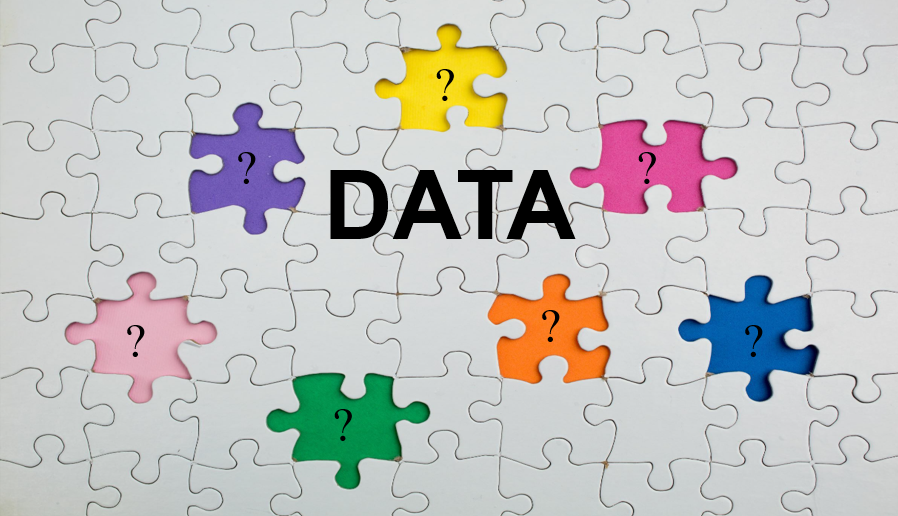

#  Evaluating Missing Data Handling Techniques Under Different Missingness Mechanisms

## Overview

In epidemiological and clinical research, missing data is a common statistical challenge. Whether
due to participant dropout, data collection errors, or selective non response, missingness can
lead to biased parameter estimates, loss of statistical power, and invalid inferences if not
properly addressed. 

## Methods

To be updated

## Key Insights

To be updated